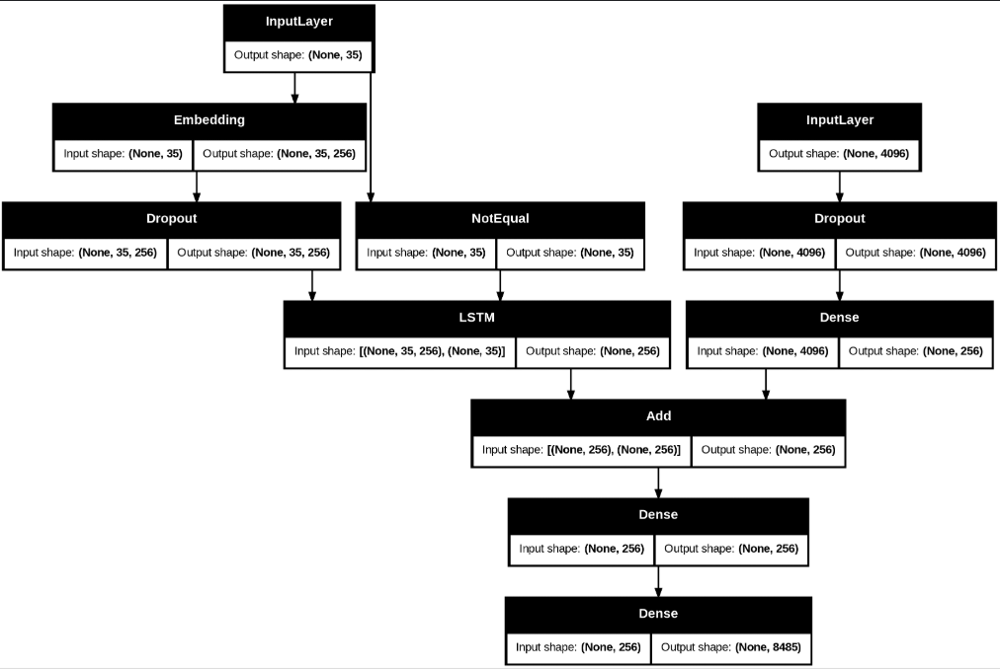
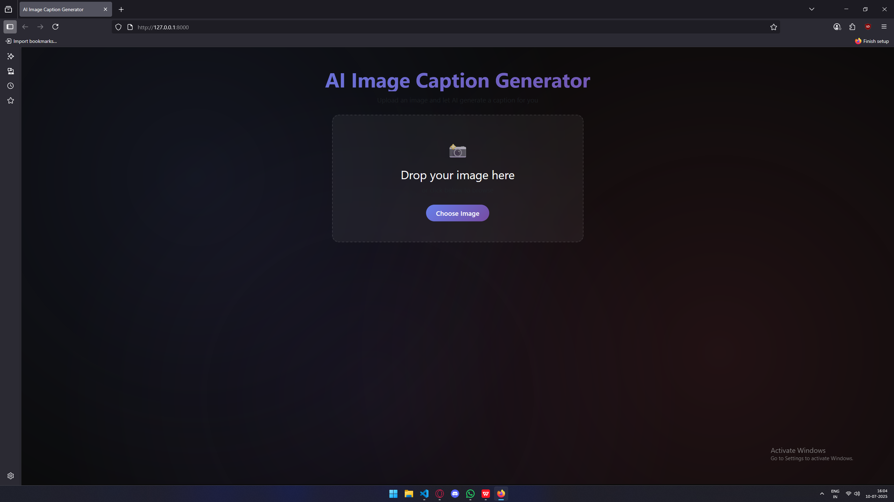
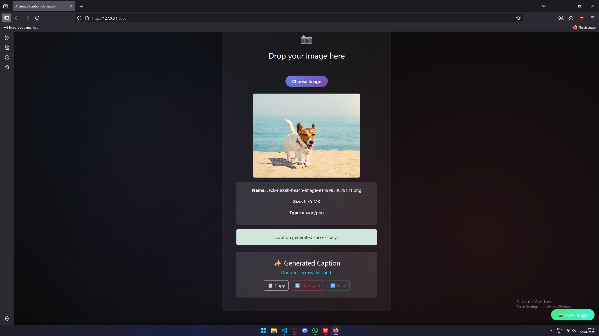

# 🖼️ Image Caption Generator Web App

This project is a web application built using **Django** that provides automatic **captions for uploaded images**, utilizing **Natural Language Processing (NLP)** and **Deep Learning**.

---

## 📚 Model Overview


- **Dataset**: [Flickr8k](https://www.kaggle.com/datasets/adityajn105/flickr8k)
  - 8,000 images
  - 5 captions per image

- **Feature Extraction**:
  - Uses **pretrained VGG16**
  - Last 2 layers removed to retain only feature extraction
  - Extracted features stored in a dictionary: `features[image_id] = list of captions`

- **Text Processing**:
  - Captions are cleaned and preprocessed
  - Tokenizer is fit on cleaned captions to build vocabulary

- **Train/Test Split**:
  - 90% Training
  - 10% Testing

- **Model Training**:
  - **Loss function**: Categorical Crossentropy
  - **Optimizer**: Adam
  - **Epochs**: 20

- **Evaluation**:
  - **BLEU-1**: 0.52
  - **BLEU-2**: 0.29


---

## 🌐 Web Application


- Framework: **Django**
- Frontend: **Bootstrap** for styling
- **AJAX** for smooth image upload and caption display
- Contains a single view that:
  - Accepts image upload
  - Displays the generated caption
- The model is loaded from the `utils/test.py` script



---

## 🚀 Setup Instructions
1. **Run Model_Training.ipynb present in webapp\utils**
1. **Create Virtual Environment**:
   ```bash
   python -m venv virtual
   virutal\Scripts\Activate.bat
   pip install -r requirements.txt
   cd webapp
   python manage.py runserver
